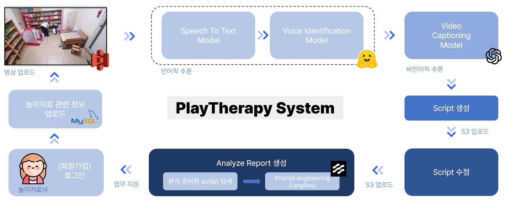

# PlayTherapy_Backend

**PlayTherapy**는 전공 연구 학점제로 진행된 프로젝트로, 놀이치료사의 치료 과정 영상을 시스템에 올리면, **음성 인식** 및 **video captioning**을 통해 **스크립트**를 생성하고, 이를 바탕으로 **치료 report**를 자동으로 작성해주는 시스템입니다.

현재 레포지토리에는 다음과 같은 <b>3가지 API</b>가 포함되어 있으며, script 생성하는 API 부분은 제외되어 있습니다.
- `auth` : 회원가입 및 로그인 기능 제공
- `contents` : 영상, 스크립트, 치료 아동 및 회기 정보 업로드 / 다운로드 / 수정 / 삭제 기능 제공
- `analyze` : 스크립트를 바탕으로 치료 과정 분석 report를 작성하는 기능 제공


## Install Env

```bash
pip install poetry
```

## Install Dependency

```bash
cd api/{api명}-api
poetry install --sync
```

## Run 

```bash
poetry run uvicorn main:app --reload --app-dir {api명}
```

## Test
전체 테스트
```bash
./run_tests.bat
```

api별 테스트 : 해당 디렉토리({api명}-api)에 접근한 뒤 실행
```bash
poetry run python -m unittest discover -s tests
```

## image build

전체 프로젝트 Root 에서 실행하세요.

```bash
docker build -t 760282210016.dkr.ecr.ap-northeast-2.amazonaws.com/dsail/playtherapy/{api명}-api . --build-arg SOURCE_DIR=api/{api명}-api --build-arg APP_DIR={api명}
```

## image run 

```bash
docker run -ti -p 8000:8000 760282210016.dkr.ecr.ap-northeast-2.amazonaws.com/dsail/playtherapy/{api명}-api
```

## Build And Push by script

```bash
./build_and_push.sh {api명}
```

```bash
./build_and_push.bat {api명}
```

