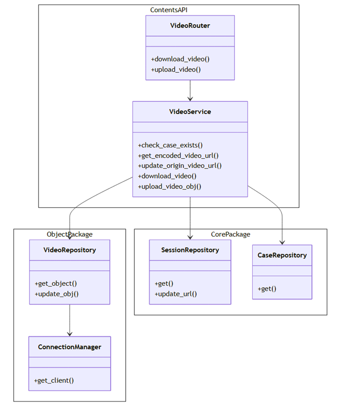
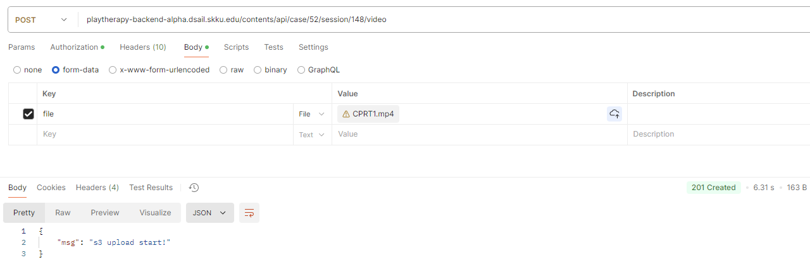
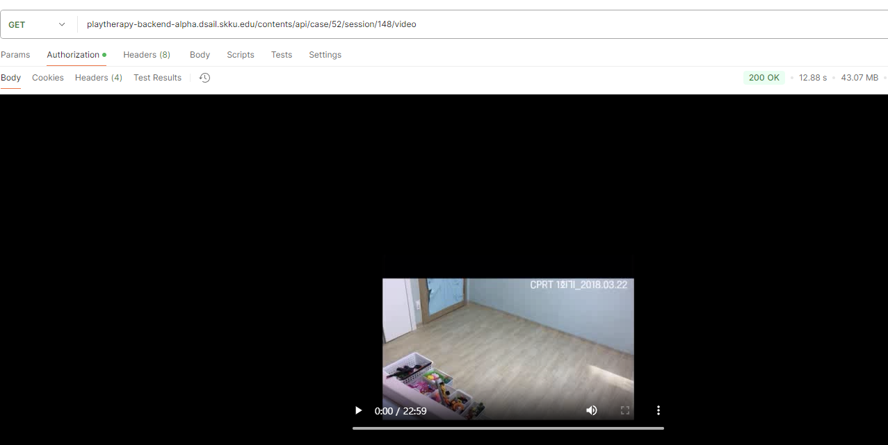
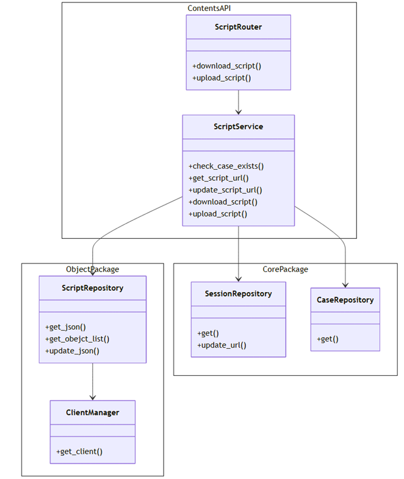
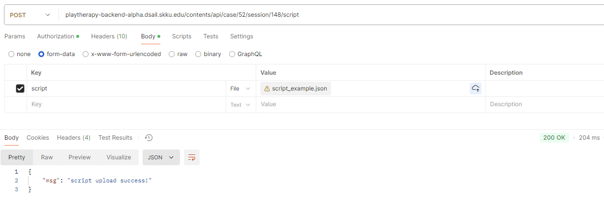
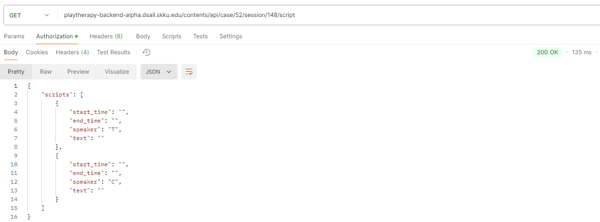
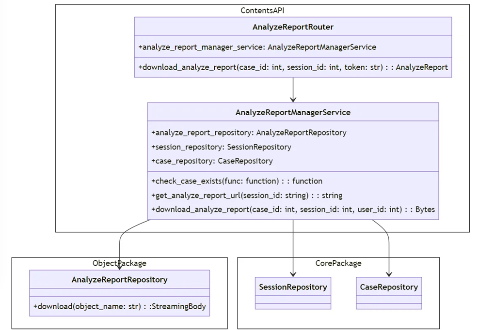
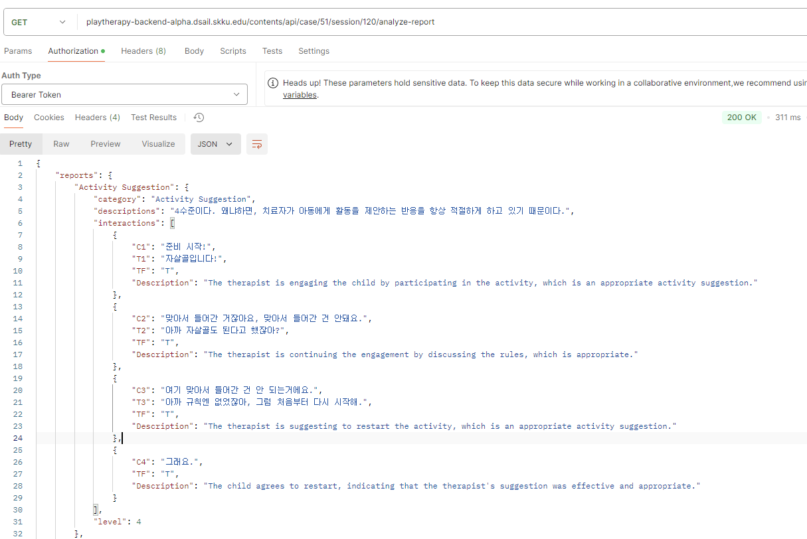

# PlayTherapy_Backend/contents-api
아동 정보와 치료 기록을 등록 및 수정, 반환하는 API을 제공하며, 이를 통해 사용자가 치료 기록 별 치료 영상을 등록하고, 생성된 스크립트를 확인할 수도 있습니다.
## How to use

### Install Env

```bash
pip install poetry
```

### Install Dependency

```bash
cd api/contents-api
poetry install --sync
```

### Run
```bash
cd api/contents-api
poetry run uvicorn main:app --reload  --app-dir contents
```

### Test

```bash
cd api/contents-api
poetry run python -m unittest discover -s tests
```

## Case
> 아동 정보에 관한 서비스

## Session
> 아동 별 치료(회기) 기록에 관한 서비스

## Video
> 치료 영상에 관한 서비스

### Class Diagram


### API
1. video upload api
    
    > video를 local을 거치지 않고 s3에 바로 upload한다.

    - **비동기 처리** : background task로 먼저 response message를 내리고, 그 다음 s3로 올린다.
    
    - case_id와 session_id를 입력 + file (Request Body : form-data, file)
    - error handling
        - UploadFailed (400)
        - SessionNotFound (400)
        - CaseNotFound (400)
        - InvalidToken (401)
    
    - **test**
        - request를 하면 먼저 201 response가 보이고, 이후에 upload가 진행됨.
            
            request ('days_by_gone.mp4'를 입력)

        
2. video download api
    
    > s3에 있는 encoding된 영상을 가져와서 download한다.
    
    - case_id와 session_id를 입력
    - error handling (status code / error code)
        - VideoNotFound(400)
        - SessionNotFound (400)
        - CaseNotFound (400)
        - InvalidToken (401)
    
    - response 예시
        

## Script
> 영상에서 추출된 스크립트에 관한 서비스

### Class Diagram

### API
1. script upload
    
    - background task로 s3로 올렸던 video upload와 달리 동기(sync)로 실행
        
    - 실험 결과 (2.45s)
        
        
        
        
2. script download
    
    JSON으로 response가 내려온다. **media_type="application/json”**
    
    - 실험 결과 (159ms)
        
        
## Analyze Report
> 스크립트로 평가한 결과 리포트에 관한 서비스

### Class Diagram


### API

- GET
